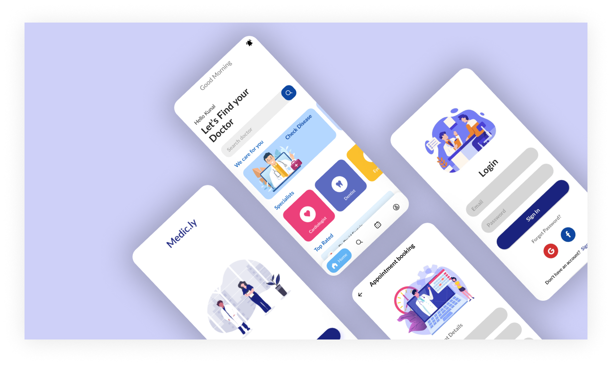

# Medic.ly - Health and Doctor Appointment

This is UI model of the Online Doctor Appointment booking App. It is connected to firebase for authentication and data storage.

<p align="center">
<a href="https://hits.seeyoufarm.com"></a>

<h2>Project UI/UX case study portfolio</h2>

[Behance Link :arrow_upper_right:](https://www.behance.net/gallery/118230811/Doctor-Appointment-App)
<br/>
<br/>

<h2>Directory Structure</h2>

```
lib
│───main.dart
│───mainPage.dart
│───carouselSlider.dart
│───updateUserDetails.dart
└───firestore-data
    |───appointmentHistoryList.dart
    |───myAppointmentList.dart
    |───notificationList.dart
    |───searchList.dart
    |───topRatedListList.dart
    └───UserDetails.dart

└───model
    |───bannerModel.dart
    └───cardModel.dart

└───screens
    |───bookingScreen.dart
    |───disease.dart
    |───diseasedetail.dart
    |───doctorProfile.dart
    |───doctorList.dart
    |───exploreList.dart
    |───firebaseAuth.dart
    |───homePage.dart
    |───myAppointments.dart
    |───register.dart
    |───aignIn.dart
    |───skip.dart
    |───userProfile.dart
    └───userSettings.dart
```

<h2>Firestore collection structure</h2>

```
appointments
|───all (full history of appointments registered)
|───
└───pending (only future apponitments)
|───
|
disease
|───
|
doctors
|───
|
users
|───

```

<h2>Pull Requests</h2>
<p>Add a pull request to contribute to this project with a proper fix or feature.</p>
<br/>

<h3>Some features still under development</h3>

- Notification
- Disease
- Google Sign in
- Forgot password
- Intoduction sceens


